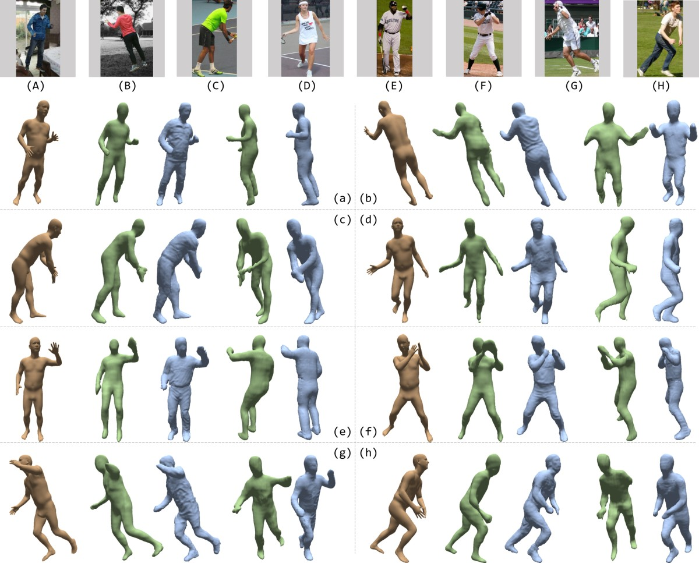
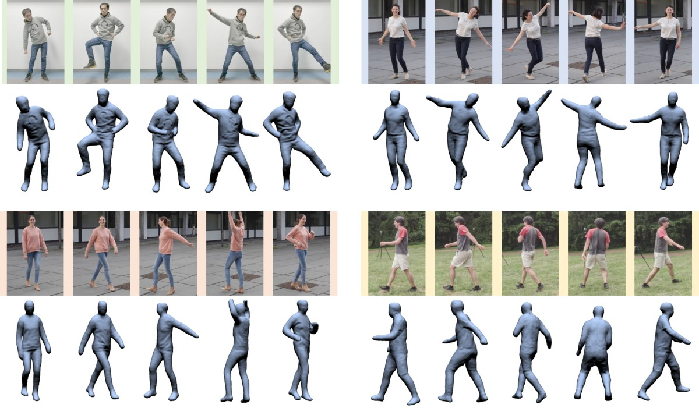







### Requirements
- python 2.7
- numpy
- tensorflow-gpu
- opendr
- opencv-python

### Installation
1. Setup im2smpl 

2. Clone this repository and install required libraries:
    ```bash
    cd path/to/deephuman
    git clone https://github.com/unaisshazan/3Dhuman-pose-detection
    cd DeepHuman
    vertualenv deephuman_env
    source deephuman_env/bin/activate
    pip install -r requirements.txt
    ```

3. Build voxelizer:
    ```bash
    cd voxelizer 
    mkdir build & cd build
    cmake ..
    make
    ```

4. Change the path configuration at LINE ```23``` of ```main_prepare_natural_img.py``` accordingly

5. Download our pre-trained model:
    ```bash
    mkdir results & cd results
    wget https://github.com/ZhengZerong/DeepHuman/releases/download/0.0/results_final_19_09_30_10_29_33.tar.gz
    tar -xzf results_final_19_09_30_10_29_33.tar.gz
    ```

### Testing
```bash
python2 main_prepare_natural_img.py --file ./examples/img.jpg
python2 main_infer_natural_img.py --file ./examples/img.jpg
```
